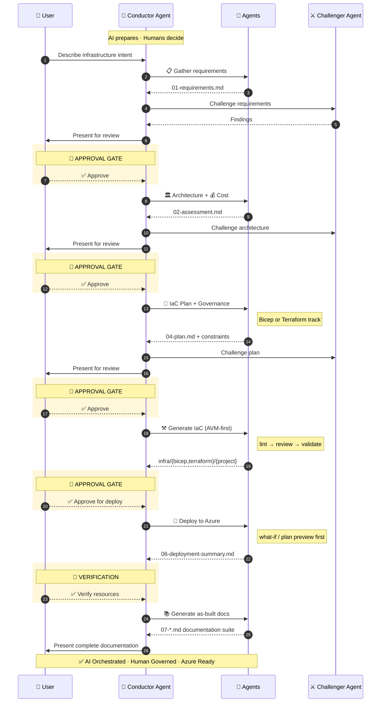

import { Card, CardGrid, LinkCard } from '@astrojs/starlight/components';

## Explore the Documentation

<CardGrid>
  <LinkCard
    title="Getting Started"
    description="Set up from the Accelerator template and run your first agent workflow."
    href="/azure-agentic-infraops/getting-started/quickstart/"
  />
  <LinkCard
    title="How It Works"
    description="Understand the multi-agent architecture, skills system, and workflow."
    href="/azure-agentic-infraops/concepts/how-it-works/"
  />
  <LinkCard
    title="Workflow"
    description="The multi-step journey from requirements to deployed infrastructure."
    href="/azure-agentic-infraops/concepts/workflow/"
  />
  <LinkCard
    title="Prompt Guide"
    description="Ready-to-use prompt examples for every agent and skill."
    href="/azure-agentic-infraops/guides/prompt-guide/"
  />
  <LinkCard
    title="Troubleshooting"
    description="Common issues, diagnostic decision tree, and solutions."
    href="/azure-agentic-infraops/guides/troubleshooting/"
  />
  <LinkCard
    title="Agent Hooks"
    description="Automated code quality enforcement during agent sessions."
    href="/azure-agentic-infraops/guides/hooks/"
  />
  <LinkCard
    title="Glossary"
    description="Quick reference for terms used throughout the documentation."
    href="/azure-agentic-infraops/reference/glossary/"
  />
  <LinkCard
    title="FAQ"
    description="Answers to common questions about the project and customization."
    href="/azure-agentic-infraops/reference/faq/"
  />
</CardGrid>

---

## Key Facts

|                 |                                                          |
| --------------- | -------------------------------------------------------- |
| **Agents**      | Specialized top-level agents and subagents               |
| **Skills**      | Reusable domain knowledge modules                        |
| **IaC Tracks**  | Bicep and Terraform (dual-track)                         |
| **MCP Servers** | GitHub, Azure Pricing, Terraform + Azure MCP (extension) |

---

## Workflow

